# Examen

# **1. Modelo entidad/relación**

~~~ sql

CREATE TABLE cliente (
  id SERIAL CHECK(id > 0) PRIMARY KEY,
  nombre VARCHAR(100) NOT NULL,
  apellido1 VARCHAR(100) NOT NULL,
  apellido2 VARCHAR(100),
  ciudad VARCHAR(100),
  categoria INT CHECK(categoria > 0)
);

CREATE TABLE comercial (
  id SERIAL CHECK(id > 0) PRIMARY KEY,
  nombre VARCHAR(100) NOT NULL,
  apellido1 VARCHAR(100) NOT NULL,
  apellido2 VARCHAR(100),
  comision NUMERIC(10,2)
);

CREATE TABLE pedido (
  id SERIAL CHECK(id > 0) PRIMARY KEY,
  total NUMERIC(10,2) NOT NULL,
  fecha DATE,
  id_cliente INT CHECK(id_cliente > 0) NOT NULL,
  id_comercial INT CHECK(id_comercial > 0) NOT NULL,
  FOREIGN KEY (id_cliente) REFERENCES cliente(id),
  FOREIGN KEY (id_comercial) REFERENCES comercial(id)
);

INSERT INTO cliente VALUES(1, 'Aarón', 'Rivero', 'Gómez', 'Almería', 100);
INSERT INTO cliente VALUES(2, 'Adela', 'Salas', 'Díaz', 'Granada', 200);
INSERT INTO cliente VALUES(3, 'Adolfo', 'Rubio', 'Flores', 'Sevilla', NULL);
INSERT INTO cliente VALUES(4, 'Adrián', 'Suárez', NULL, 'Jaén', 300);
INSERT INTO cliente VALUES(5, 'Marcos', 'Loyola', 'Méndez', 'Almería', 200);
INSERT INTO cliente VALUES(6, 'María', 'Santana', 'Moreno', 'Cádiz', 100);
INSERT INTO cliente VALUES(7, 'Pilar', 'Ruiz', NULL, 'Sevilla', 300);
INSERT INTO cliente VALUES(8, 'Pepe', 'Ruiz', 'Santana', 'Huelva', 200);
INSERT INTO cliente VALUES(9, 'Guillermo', 'López', 'Gómez', 'Granada', 225);
INSERT INTO cliente VALUES(10, 'Daniel', 'Santana', 'Loyola', 'Sevilla', 125);

INSERT INTO comercial VALUES(1, 'Daniel', 'Sáez', 'Vega', 0.15);
INSERT INTO comercial VALUES(2, 'Juan', 'Gómez', 'López', 0.13);
INSERT INTO comercial VALUES(3, 'Diego','Flores', 'Salas', 0.11);
INSERT INTO comercial VALUES(4, 'Marta','Herrera', 'Gil', 0.14);
INSERT INTO comercial VALUES(5, 'Antonio','Carretero', 'Ortega', 0.12);
INSERT INTO comercial VALUES(6, 'Manuel','Domínguez', 'Hernández', 0.13);
INSERT INTO comercial VALUES(7, 'Antonio','Vega', 'Hernández', 0.11);
INSERT INTO comercial VALUES(8, 'Alfredo','Ruiz', 'Flores', 0.05);

INSERT INTO pedido VALUES(1, 150.5, '2017-10-05', 5, 2);
INSERT INTO pedido VALUES(2, 270.65, '2016-09-10', 1, 5);
INSERT INTO pedido VALUES(3, 65.26, '2017-10-05', 2, 1);
INSERT INTO pedido VALUES(4, 110.5, '2016-08-17', 8, 3);
INSERT INTO pedido VALUES(5, 948.5, '2017-09-10', 5, 2);
INSERT INTO pedido VALUES(6, 2400.6, '2016-07-27', 7, 1);
INSERT INTO pedido VALUES(7, 5760, '2015-09-10', 2, 1);
INSERT INTO pedido VALUES(8, 1983.43, '2017-10-10', 4, 6);
INSERT INTO pedido VALUES(9, 2480.4, '2016-10-10', 8, 3);
INSERT INTO pedido VALUES(10, 250.45, '2015-06-27', 8, 2);
INSERT INTO pedido VALUES(11, 75.29, '2016-08-17', 3, 7);
INSERT INTO pedido VALUES(12, 3045.6, '2017-04-25', 2, 1);
INSERT INTO pedido VALUES(13, 545.75, '2019-01-25', 6, 1);
INSERT INTO pedido VALUES(14, 145.82, '2017-02-02', 6, 1);
INSERT INTO pedido VALUES(15, 370.85, '2019-03-11', 1, 5);
INSERT INTO pedido VALUES(16, 2389.23, '2019-03-11', 1, 5);

~~~

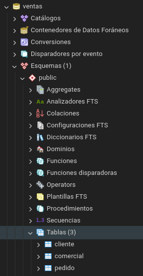

#

# **2 Consultas sobre una tabla**

1. Devuelve un listado con todos los pedidos que se han realizado. Los pedidos deben estar ordenados por la fecha de realización, mostrando en primer lugar los pedidos más recientes.

    ~~~ sql

    SELECT * FROM pedido ORDER BY fecha DESC;

    ~~~

    

2. Devuelve todos los datos de los dos pedidos de mayor valor.

    ~~~ sql

    SELECT p.id, p.total, p.fecha, c.nombre AS "Nombre cliente", c.apellido1 AS "Apellido1 cliente", 
    c.apellido2 AS "Apellido2 cliente", c.ciudad AS "Ciudad cliente", com.nombre AS "Nombre comercial", 
    com.apellido1 AS "Apellido1 comercial", com.apellido2 AS "Apellido2 comercial"  FROM pedido AS p

    JOIN cliente AS c ON (p.id_cliente = c.id)
    JOIN comercial AS com ON (p.id_comercial = com.id)
    ORDER BY total DESC;

    ~~~

    

3. Devuelve un listado con los identificadores de los clientes que han realizado algún pedido. Tenga en cuenta que no debe mostrar identificadores que estén repetidos.

    ~~~ sql

    SELECT id_cliente FROM pedido GROUP BY id_cliente ORDER BY id_cliente;

    ~~~

    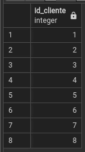

4. Devuelve un listado de todos los pedidos que se realizaron durante el año 2017, cuya cantidad total sea superior a 500€.

    ~~~ sql

    SELECT * FROM pedido WHERE EXTRACT(YEAR FROM fecha) = 2017;

    ~~~

    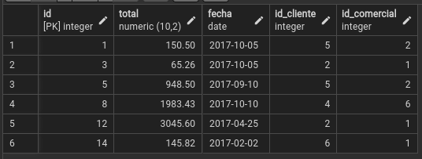

5. Devuelve un listado con el nombre y los apellidos de los comerciales que tienen una comisión entre 0.05 y 0.11.

    ~~~ sql

    SELECT * FROM comercial WHERE comision BETWEEN 0.05 AND 0.11;

    ~~~

    

6. Devuelve el valor de la comisión de mayor valor que existe en la tabla `comercial`.

    ~~~ sql

    SELECT * FROM comercial ORDER BY comision DESC LIMIT 1;

    ~~~

    

7. Devuelve el identificador, nombre y primer apellido de aquellos clientes cuyo segundo apellido **no** es `NULL`. El listado deberá estar ordenado alfabéticamente por apellidos y nombre.

    ~~~ sql

    SELECT id, nombre, apellido1 FROM cliente WHERE apellido2 IS NOT NULL;

    ~~~

    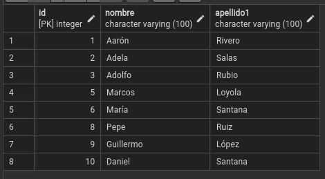

8. Devuelve un listado de los nombres de los clientes que empiezan por `A` y terminan por `n` y también los nombres que empiezan por `P`. El listado deberá estar ordenado alfabéticamente.

    ~~~ sql

    SELECT nombre FROM cliente WHERE nombre ILIKE 'a%' AND nombre ILIKE '%n' OR nombre ILIKE 'p%'
    ORDER BY nombre;

    ~~~

    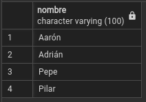

9. Devuelve un listado de los nombres de los clientes que **no** empiezan por `A`. El listado deberá estar ordenado alfabéticamente.

    ~~~ sql

    SELECT nombre FROM cliente WHERE nombre NOT ILIKE 'a%' ORDER BY nombre;

    ~~~

    

10. Devuelve un listado con los nombres de los comerciales que terminan por `el` o `o`. Tenga en cuenta que se deberán eliminar los nombres repetidos.

    ~~~ sql

    SELECT nombre FROM comercial WHERE nombre ILIKE '%el' OR nombre ILIKE '%o' 
    GROUP BY nombre ORDER BY nombre;

    ~~~

    

#

# **2. Consultas multitabla (Composición interna)**

Resuelva todas las consultas utilizando la sintaxis de `SQL1` y `SQL2`.

1. Devuelve un listado con el identificador, nombre y los apellidos de todos los clientes que han realizado algún pedido. El listado debe estar ordenado alfabéticamente y se deben eliminar los elementos repetidos.

    ~~~ sql

    SELECT c.id, c.nombre, c.apellido1, c.apellido2 FROM pedido AS p
    JOIN cliente AS c ON (p.id_cliente = c.id)
    GROUP BY c.id ORDER BY c.nombre, c.apellido1, c.apellido2;

    ~~~

    

2. Devuelve un listado que muestre todos los pedidos que ha realizado cada cliente. El resultado debe mostrar todos los datos de los pedidos y del cliente. El listado debe mostrar los datos de los clientes ordenados alfabéticamente.

    ~~~ sql

    SELECT c.id, c.nombre, c.apellido1, c.apellido2, c.ciudad, c.categoria, p.id, p.total, p.fecha, p.id_comercial FROM pedido AS p
    JOIN cliente AS c ON (p.id_cliente = c.id)
    GROUP BY c.id, c.nombre, c.apellido1, c.apellido2, c.ciudad, c.categoria, p.id, p.total, p.fecha, p.id_comercial
    ORDER BY c.nombre, c.apellido1, c.apellido2;

    ~~~

    

3. Devuelve un listado que muestre todos los pedidos en los que ha participado un comercial. El resultado debe mostrar todos los datos de los pedidos y de los comerciales. El listado debe mostrar los datos de los comerciales ordenados alfabéticamente.

    ~~~ sql

    SELECT c.id, c.nombre, c.apellido1, c.apellido2, c.comision, p.id, p.total, p.fecha, p.id_comercial FROM pedido AS p
    JOIN comercial AS c ON (p.id_comercial = c.id)
    GROUP BY c.id, c.nombre, c.apellido1, c.apellido2, c.comision, p.id, p.total, p.fecha, p.id_comercial
    ORDER BY c.nombre, c.apellido1, c.apellido2;

    ~~~

    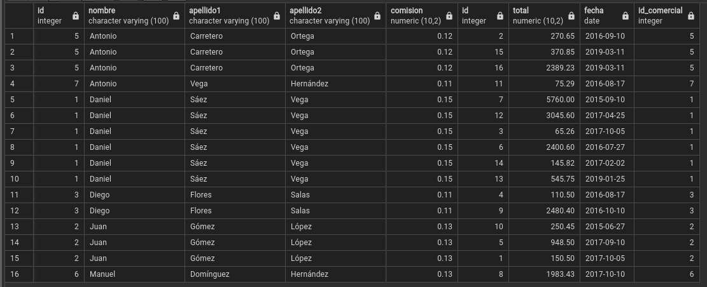

4. Devuelve un listado que muestre todos los clientes, con todos los pedidos que han realizado y con los datos de los comerciales asociados a cada pedido.

    ~~~ sql

    SELECT p.id, p.total, p.fecha, c.id, c.nombre AS "Nombre cliente", c.apellido1 AS "Apellido1 cliente", 
    c.apellido2 AS "Apellido2 cliente", c.ciudad AS "Ciudad cliente", c.categoria AS "Categoría cliente", com.id, com.nombre AS "Nombre comercial", 
    com.apellido1 AS "Apellido1 comercial", com.apellido2 AS "Apellido2 comercial", com.comision  FROM pedido AS p

    JOIN cliente AS c ON (p.id_cliente = c.id)
    JOIN comercial AS com ON (p.id_comercial = com.id)
    ORDER BY c.nombre, c.apellido1, c.apellido2;

    ~~~

    

5. Devuelve un listado de todos los clientes que realizaron un pedido durante el año `2017`, cuya cantidad esté entre `300` € y `1000` €.

    ~~~ sql

    SELECT c.id, c.nombre, c.apellido1, c.apellido2, c.ciudad, c.categoria, p.id, p.total, p.fecha, p.id_comercial FROM pedido AS p
    JOIN cliente AS c ON (p.id_cliente = c.id)
    WHERE EXTRACT(YEAR FROM fecha) = 2017 AND p.total BETWEEN 300 AND 1000;

    ~~~

    

6. Devuelve el nombre y los apellidos de todos los comerciales que ha participado en algún pedido realizado por `María Santana Moreno`.

    ~~~ sql

    SELECT * FROM comercial AS c
    JOIN pedido AS p ON (c.id = p.id_comercial)
    WHERE p.id_cliente = 6;

    ~~~

    

7. Devuelve el nombre de todos los clientes que han realizado algún pedido con el comercial `Daniel Sáez Vega`.

    ~~~ sql

    SELECT * FROM cliente AS c
    JOIN pedido AS p ON (c.id = p.id_cliente)
    JOIN comercial AS com ON (p.id_comercial = com.id)
    WHERE p.id_comercial = 1;

    ~~~

    

#

# **3. Consultas multitabla (Composición externa)**

Resuelva todas las consultas utilizando las cláusulas `LEFT JOIN` y `RIGHT JOIN`.

1. Devuelve un listado con **todos los clientes** junto con los datos de los pedidos que han realizado. Este listado también debe incluir los clientes que no han realizado ningún pedido. El listado debe estar ordenado alfabéticamente por el primer apellido, segundo apellido y nombre de los clientes.

    ~~~ sql

    SELECT c.nombre AS "Nombre cliente", c.apellido1 AS "Apellido1 cliente", 
    c.apellido2 AS "Apellido2 cliente", c.ciudad AS "Ciudad cliente", c.categoria AS "Categoría cliente",
	p.id, p.total, p.fecha, p.id_comercial FROM cliente AS c
	
	LEFT JOIN pedido AS p ON (c.id = p.id_cliente)
	ORDER BY c.nombre, c.apellido1, c.apellido2;

    ~~~

    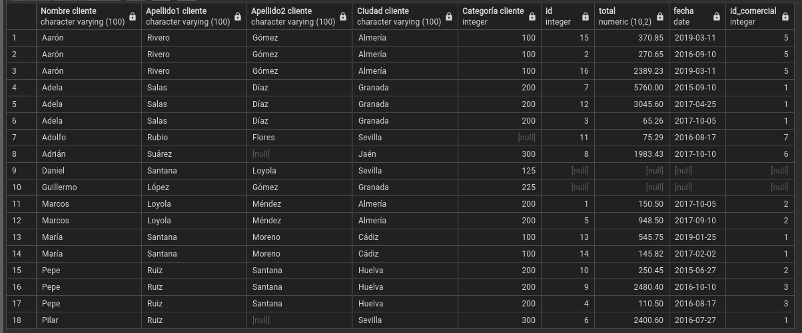

2. Devuelve un listado con **todos los comerciales** junto con los datos de los pedidos que han realizado. Este listado también debe incluir los comerciales que no han realizado ningún pedido. El listado debe estar ordenado alfabéticamente por el primer apellido, segundo apellido y nombre de los comerciales.

    ~~~ sql

    SELECT com.id, com.nombre AS "Nombre comercial", 
    com.apellido1 AS "Apellido1 comercial", com.apellido2 AS "Apellido2 comercial", com.comision,
	p.id, p.total, p.fecha, p.id_comercial FROM comercial AS com
	
	LEFT JOIN pedido AS p ON (com.id = p.id_comercial)
	ORDER BY com.nombre, com.apellido1, com.apellido2;

    ~~~

    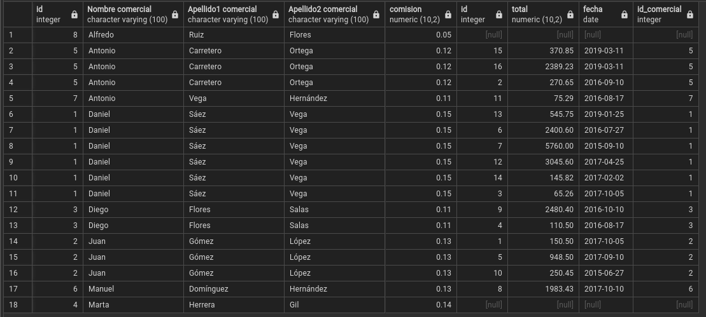

3. Devuelve un listado que solamente muestre los clientes que no han realizado ningún pedido.

    ~~~ sql

    SELECT c.id, c.nombre AS "Nombre cliente", c.apellido1 AS "Apellido1 cliente", 
    c.apellido2 AS "Apellido2 cliente", c.ciudad AS "Ciudad cliente", 
	c.categoria AS "Categoría cliente" FROM cliente AS c

	LEFT JOIN pedido AS p ON (c.id = p.id_cliente)
	WHERE p.id_cliente IS NULL;

    ~~~

    

4. Devuelve un listado que solamente muestre los comerciales que no han realizado ningún pedido.

    ~~~ sql

    SELECT com.id, com.nombre AS "Nombre comercial", 
    com.apellido1 AS "Apellido1 comercial", 
	com.apellido2 AS "Apellido2 comercial", 
	com.comision FROM comercial AS com
	
	LEFT JOIN pedido AS p ON (com.id = p.id_comercial)
	WHERE p.id_comercial IS NULL;

    ~~~

    

5. Devuelve un listado con los clientes que no han realizado ningún pedido y de los comerciales que no han participado en ningún pedido. Ordene el listado alfabéticamente por los apellidos y el nombre. En en listado deberá diferenciar de algún modo los clientes y los comerciales.

    ~~~ sql

    SELECT c.id, c.nombre AS "Nombre cliente", c.apellido1 AS "Apellido1 cliente", 
    c.apellido2 AS "Apellido2 cliente", c.ciudad AS "Ciudad cliente", 
	c.categoria AS "Categoría cliente", com.id, com.nombre AS "Nombre comercial", 
    com.apellido1 AS "Apellido1 comercial", 
	com.apellido2 AS "Apellido2 comercial", 
	com.comision FROM cliente AS c
	
	FULL JOIN pedido AS p ON (c.id = p.id_cliente)
	FULL JOIN comercial AS com ON (p.id_comercial = com.id)
	WHERE p.id_cliente IS NULL OR p.id_comercial IS NULL;

    ~~~

    

6. ¿Se podrían realizar las consultas anteriores con `NATURAL LEFT JOIN` o `NATURAL RIGHT JOIN`? Justifique su respuesta.

    ~~~

    No se podrían realizar, porque las columnas relacionadas deben llamarse igual en todas las tablas, Natural join une en referencia del nombre de las columnas y en este caso no se cumple, ejemplo: en la tabla cliente la columna con los id's se llama id, sin embargo, en la tabla pedido donde está relacionada toma el nombre de id_cliente.

    ~~~

#

# **4. Consultas resumen**

1. Calcula la cantidad total que suman todos los pedidos que aparecen en la tabla `pedido`.

    ~~~ sql

    SELECT SUM(total) AS "Valor Total pedidos" FROM pedido;

    ~~~

    

2. Calcula la cantidad media de todos los pedidos que aparecen en la tabla `pedido`.

    ~~~ sql

    SELECT  ROUND(CAST(AVG(total) AS NUMERIC), 2) AS "Valor media pedidos" FROM pedido;

    ~~~

    

3. Calcula el número total de comerciales distintos que aparecen en la tabla `pedido`.

    ~~~ sql

    SELECT  COUNT(DISTINCT(id_comercial)) AS "Cantidad comerciales" FROM pedido;

    ~~~

    

4. Calcula el número total de clientes que aparecen en la tabla `cliente`.

    ~~~ sql

    SELECT  COUNT(id) AS "Cantidad clientes" FROM cliente;

    ~~~

    

5. Calcula cuál es la mayor cantidad que aparece en la tabla `pedido`.

    ~~~ sql

    SELECT  MAX(total) FROM pedido;

    ~~~

    

6. Calcula cuál es la menor cantidad que aparece en la tabla `pedido`.

    ~~~ sql

    SELECT  MIN(total) FROM pedido;

    ~~~

    

7. Calcula cuál es el valor máximo de categoría para cada una de las ciudades que aparece en la tabla `cliente`.

    ~~~ sql

    SELECT ciudad, MAX(categoria) FROM cliente GROUP BY ciudad;

    ~~~

    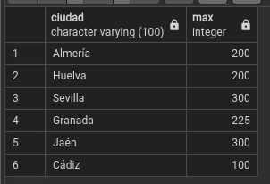

8. Calcula cuál es el máximo valor de los pedidos realizados durante el mismo día para cada uno de los clientes. Es decir, el mismo cliente puede haber realizado varios pedidos de diferentes cantidades el mismo día. Se pide que se calcule cuál es el pedido de máximo valor para cada uno de los días en los que un cliente ha realizado un pedido. Muestra el identificador del cliente, nombre, apellidos, la fecha y el valor de la cantidad.

    ~~~ sql

    SELECT c.id, c.nombre AS "Nombre cliente", c.apellido1 AS "Apellido1 cliente", 
    c.apellido2 AS "Apellido2 cliente", p.fecha, MAX(p.total) FROM pedido AS p
	JOIN cliente AS c ON (p.id_cliente = c.id)
	
	GROUP BY c.id, c.nombre, c.apellido1, c.apellido2, p.fecha
	ORDER BY c.nombre, c.apellido1, c.apellido2

    ~~~

    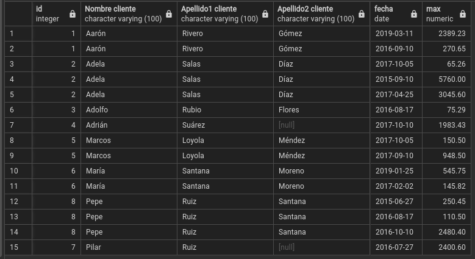

9. Calcula cuál es el máximo valor de los pedidos realizados durante el mismo día para cada uno de los clientes, teniendo en cuenta que sólo queremos mostrar aquellos pedidos que superen la cantidad de 2000 €.

    ~~~ sql

    SELECT c.id, c.nombre AS "Nombre cliente", c.apellido1 AS "Apellido1 cliente", 
    c.apellido2 AS "Apellido2 cliente", p.fecha, MAX(p.total) FROM pedido AS p
	JOIN cliente AS c ON (p.id_cliente = c.id)
	WHERE p.total > 2000
	GROUP BY c.id, c.nombre, c.apellido1, c.apellido2, p.fecha
	ORDER BY c.nombre, c.apellido1, c.apellido2

    ~~~

    

10. Calcula el máximo valor de los pedidos realizados para cada uno de los comerciales durante la fecha `2016-08-17`. Muestra el identificador del comercial, nombre, apellidos y total.

    ~~~ sql

    SELECT c.id, c.nombre, c.apellido1, c.apellido2, MAX(p.total) FROM comercial AS c
    JOIN pedido AS p ON (p.id_comercial = c.id)
    WHERE p.fecha = '2016-08-17'
    GROUP BY c.id, c.nombre, c.apellido1, c.apellido2

    ~~~

    

11. Devuelve un listado con el identificador de cliente, nombre y apellidos y el número total de pedidos que ha realizado cada uno de clientes. Tenga en cuenta que pueden existir clientes que no han realizado ningún pedido. Estos clientes también deben aparecer en el listado indicando que el número de pedidos realizados es `0`.

    ~~~ sql

    SELECT c.id, c.nombre AS "Nombre cliente", c.apellido1 AS "Apellido1 cliente", 
    c.apellido2 AS "Apellido2 cliente", COUNT(p.id_cliente) FROM cliente AS c
	LEFT JOIN pedido AS p ON (c.id = p.id_cliente)
	GROUP BY c.id, c.nombre, c.apellido1, c.apellido2

    ~~~

    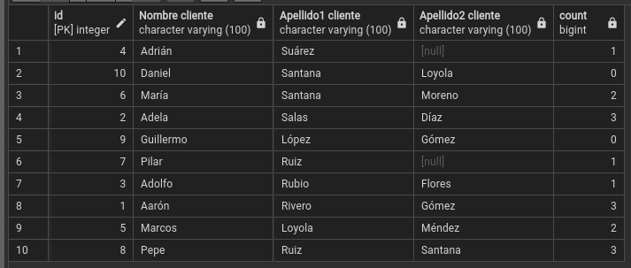

12. Devuelve un listado con el identificador de cliente, nombre y apellidos y el número total de pedidos que ha realizado cada uno de clientes **durante el año 2017**.

    ~~~ sql

    SELECT c.id, c.nombre AS "Nombre cliente", c.apellido1 AS "Apellido1 cliente", 
    c.apellido2 AS "Apellido2 cliente", COUNT(p.id_cliente) FROM cliente AS c
	JOIN pedido AS p ON (c.id = p.id_cliente)
	WHERE EXTRACT(YEAR FROM p.fecha) = 2017
	GROUP BY c.id, c.nombre, c.apellido1, c.apellido2

    ~~~

    

13. Devuelve un listado que muestre el identificador de cliente, nombre, primer apellido y el valor de la máxima cantidad del pedido realizado por cada uno de los clientes. El resultado debe mostrar aquellos clientes que no han realizado ningún pedido indicando que la máxima cantidad de sus pedidos realizados es `0`. Puede hacer uso de la función `[IFNULL](https://dev.mysql.com/doc/refman/8.0/en/control-flow-functions.html#function_ifnull)`.

    ~~~ sql

    SELECT c.id, c.nombre AS "Nombre cliente", c.apellido1 AS "Apellido1 cliente", COALESCE(MAX(p.total),0) FROM cliente AS c
	LEFT JOIN pedido AS p ON (c.id = p.id_cliente)
	GROUP BY c.id, c.nombre, c.apellido1, c.apellido2

    ~~~

    

14. Devuelve cuál ha sido el pedido de máximo valor que se ha realizado cada año.

    ~~~ sql

    SELECT EXTRACT(YEAR FROM p.fecha) AS "Año", MAX(p.total) FROM pedido AS p
	GROUP BY EXTRACT(YEAR FROM p.fecha)

    ~~~

    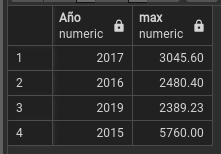

15. Devuelve el número total de pedidos que se han realizado cada año.

    ~~~ sql

    SELECT EXTRACT(YEAR FROM p.fecha) AS "Año", COUNT(p.id) FROM pedido AS p
	GROUP BY EXTRACT(YEAR FROM p.fecha)

    ~~~

    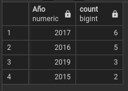

#

# **5. Con operadores básicos de comparación**

1. Devuelve un listado con todos los pedidos que ha realizado `Adela Salas Díaz`. (Sin utilizar `INNER JOIN`).

    ~~~ sql

    

    ~~~

2. Devuelve el número de pedidos en los que ha participado el comercial `Daniel Sáez Vega`. (Sin utilizar `INNER JOIN`)

    ~~~ sql

    

    ~~~

3. Devuelve los datos del cliente que realizó el pedido más caro en el año `2019`. (Sin utilizar `INNER JOIN`)

    ~~~ sql

    

    ~~~

4. Devuelve la fecha y la cantidad del pedido de menor valor realizado por el cliente `Pepe Ruiz Santana`.

    ~~~ sql

    

    ~~~

5. Devuelve un listado con los datos de los clientes y los pedidos, de todos los clientes que han realizado un pedido durante el año `2017` con un valor mayor o igual al valor medio de los pedidos realizados durante ese mismo año.

    ~~~ sql

    

    ~~~

#

# **6. Subconsultas con `ALL` y `ANY`**

1. Devuelve el pedido más caro que existe en la tabla `pedido` si hacer uso de `MAX`, `ORDER BY` ni `LIMIT`.

    ~~~ sql

    

    ~~~

2. Devuelve un listado de los clientes que no han realizado ningún pedido. (Utilizando `ANY` o `ALL`).

    ~~~ sql

    

    ~~~

3. Devuelve un listado de los comerciales que no han realizado ningún pedido. (Utilizando `ANY` o `ALL`).

    ~~~ sql

    

    ~~~

#

# **7. Subconsultas con `IN` y `NOT IN`**

1. Devuelve un listado de los clientes que no han realizado ningún pedido. (Utilizando `IN` o `NOT IN`).

    ~~~ sql

    

    ~~~

2. Devuelve un listado de los comerciales que no han realizado ningún pedido. (Utilizando `IN` o `NOT IN`).

    ~~~ sql

    

    ~~~

#

# **8. Subconsultas con `EXISTS` y `NOT EXISTS`**

1. Devuelve un listado de los clientes que no han realizado ningún pedido. (Utilizando `EXISTS` o `NOT EXISTS`).

    ~~~ sql

    

    ~~~

2. Devuelve un listado de los comerciales que no han realizado ningún pedido. (Utilizando `EXISTS` o `NOT EXISTS`).

    ~~~ sql

    

    ~~~
